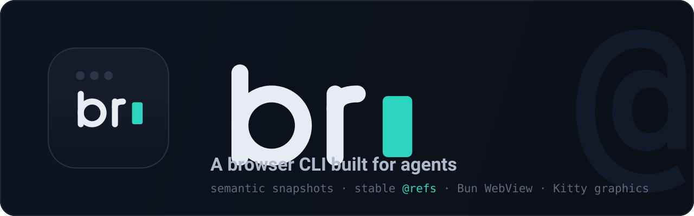

<div align="center">



<br>

[](https://github.com/pwnwriter/br/actions/workflows/ci.yml)
[](LICENSE)
[](https://ziglang.org)
[](https://bun.sh)
[](#install)
[](#status)

</div>

---

**`br` turns a web page into a compact, semantic snapshot with stable `@refs`, then lets you (or an agent) act on those refs.** No Playwright, no Selenium, no huge DOM dumps. Just a tiny command surface built for minimal context.

```console
$ br open https://example.com
$ br snap --compact

Example Domain | https://example.com/
@1 link  More information...
```

That's the whole model:

```text
browser  →  snapshot  →  @refs  →  actions
```

## Demos

Open, snapshot, click, capture:

<video src="https://github.com/user-attachments/assets/cd44fc54-bd58-44f8-b9ea-4326bfa8e6ad" controls width="100%"></video>


Live page snapshot:

<video src="https://github.com/user-attachments/assets/89d67d8e-b70a-4b8c-a71d-8530da974d43" controls width="100%"></video>

Form automation:

<video src="https://github.com/user-attachments/assets/f0c8fbc3-a0d9-49a8-a9bc-ea14c2f7a074" controls width="100%"></video>

Batch mode:

<video src="https://github.com/user-attachments/assets/adebd823-9704-42f3-91b1-bd0db269c8ab" controls width="100%"></video>

## Why br?

- **Small by design.** Not a terminal browser or a full automation framework, a thin agent interface. Zig owns the CLI and protocol; Bun's WebView owns the browser.
- **Stable `@refs`.** Every interactive element gets a short, reusable handle. If one goes stale, `br` fails loudly with `STALE_REF` instead of clicking the wrong thing.
- **Batch-native.** Multi-step flows run as JSONL in one shot, so agents do more with less back-and-forth.
- **Visual when you want it.** `br view` and `br live` render the real page inline via the Kitty graphics protocol.

## Usage

> **If it renders in a browser, `br` turns it into commands: same page, whether you're an agent, a human, or hunting bugs.**

<details>
<summary><b>🤖 As an AI agent</b>: a browser without the DOM firehose</summary>

<br>

Give your agent a browser without drowning it in DOM. It reads a compact snapshot, acts on `@refs`, and branches on exit codes. No Playwright, no flaky selectors, no 50k-token HTML dumps.

```bash
br batch <<'JSONL'
{"command":"open","url":"https://app.example.com/login"}
{"command":"snapshot","compact":true}
{"command":"fill","target":"@2","text":"user@example.com"}
{"command":"fill","target":"@3","text":"hunter2"}
{"command":"click","target":"@4"}
{"command":"snapshot","compact":true}
JSONL
```

One JSON line in, one out. Stable handles, deterministic exit codes (`STALE_REF`, `TIMEOUT`, …), and `--json` on everything: everything an agent needs to loop reliably.

</details>

<details>
<summary><b>🧑‍💻 As a human</b>: a browser you can pipe</summary>

<br>

Inspect a page, fill a form, grab a screenshot, or read it inline, without leaving the terminal or writing a script.

```bash
br open https://news.ycombinator.com
br snap --compact            # scan the interactive elements
br find "login"              # locate a control by text
br screenshot shot.png       # grab evidence
br view                      # render the viewport inline (Kitty graphics)
br live https://github.com   # full interactive terminal browser
```

Great for quick checks, demos, scraping one page, or driving a site from a shell script.

</details>

<details>
<summary><b>🛡️ For bug bounty & recon</b>: scriptable, pipeable triage</summary>

<br>

A scriptable, headful browser is a fast triage tool: map inputs, read client-side state, and run JS in page context, all pipeable into your recon pipeline. **On targets you're authorized to test.**

```bash
br --profile target open https://app.example.com/account
br snap                                              # every interactive element + its attrs
br eval 'document.cookie'                            # inspect session/CSRF state
br eval '[...document.querySelectorAll("input[type=hidden]")].map(i => [i.name, i.value])'
br attr @5 href                                      # pull hrefs, tokens, data-* attrs
br cookies                                           # dump cookies
br console                                            # surface client-side JS errors
br --backend chrome cdp Network.enable               # Chrome DevTools Protocol (Chromium only)
br screenshot finding.png                            # capture proof for the report
```

Keep separate authenticated contexts with `--profile`, script repeatable checks across params/endpoints with `batch`, and drive it all from the same tools as the rest of your recon.

</details>

> `cdp` needs the Chromium backend. Pick it per command with `--backend chrome` (the default `webkit` backend has no CDP). See [Backends](#backends).

## Install

### Download a release

Grab the tarball for your platform from [Releases](https://github.com/pwnwriter/br/releases). Each one bundles `br`, a matching Bun, and the `worker/` scripts, so it runs on a fresh machine with nothing else to install. Untar and run: `br` finds its Bun and worker beside itself.

```bash
tar xzf br-<version>-<target>.tar.gz        # e.g. br-0.1.0-aarch64-macos.tar.gz
./br-<version>-<target>/br open https://example.com
```

> [!IMPORTANT]
> **macOS:** the binary is ad-hoc signed but not notarized, so Gatekeeper blocks
> the first run (*"Apple could not verify 'br' is free of malware…"*). Clear the
> download quarantine once and it runs normally:
>
> ```bash
> xattr -dr com.apple.quarantine ./br-<version>-<target>
> # e.g. xattr -dr com.apple.quarantine ./br-0.1.0-aarch64-macos
> ```

### Build from source

You'll need **Zig** 0.16+ and **Bun** 1.4+ (with `Bun.WebView`: WebKit by default, Chromium via `--backend chrome`).

```bash
# with Nix (recommended)
nix develop
zig build
export BR_BUN="$(command -v bun)"
./zig-out/bin/br open https://example.com

# or build the packaged version
nix build
./result/bin/br open https://example.com
```

> [!TIP]
> Using a downloaded Bun? Point `br` at it with `export BR_BUN=/path/to/bun`.
> For packaged installs, set `BR_WORKER_DIR` to the installed `worker/` directory.

## Quickstart

Log in to a page in five commands:

```bash
br open https://example.com/login
br snap                      # list the interactive elements + their @refs

br fill @2 "user@example.com"
br fill @3 "$PASSWORD"
br click @4

br snap --compact            # see where you landed
```

> [!IMPORTANT]
> `@refs` only exist after a `snap`. If a page changes under you, an old ref
> goes stale, `br` fails loudly instead of clicking the wrong thing. Just
> snapshot again and use the fresh ref:
>
> ```text
> STALE_REF @4
> ```

## Batch mode

For anything multi-step, prefer `batch`: one JSON object in per line, one out. It never runs shell commands.

```bash
br batch <<'JSONL'
{"command":"open","url":"https://example.com"}
{"command":"snapshot","compact":true}
{"command":"click","target":"@1"}
{"command":"snapshot","compact":true}
JSONL
```

## Recipes

Use `record` when a human should teach `br` a workflow once, then `replay` it later from an agent, script, or shell.

```bash
br record yeswehack-login https://yeswehack.com/login --pane
br recipes
br show yeswehack-login
br replay yeswehack-login --pause-on-secret --pause-on-fail
br patch yeswehack-login
br export yeswehack-login --jsonl
br recipes delete yeswehack-login
br recipes delete --all
```

Recipes are stored locally as JSONL in `~/.local/share/br/recipes`. A recorded live session captures opens, clicks, typed input, key presses, and scrolls exactly as entered, including login values. Add `--pane` to `record` or `patch` to show the live JSONL log inside the terminal while browsing. Clicks include a selector plus coordinate fallback so replay can use the DOM when possible and still preserve the original gesture.

## Common commands

| Command | What it does |
| --- | --- |
| `open <url>` | Navigate to a page |
| `snap [--compact]` | Semantic snapshot with `@refs` |
| `click <ref\|selector>` | Click an element |
| `fill <ref> <text>` | Focus, clear, and type into a field |
| `type <text>` / `press <key>` | Send keystrokes |
| `find <text>` | Search the current refs |
| `get <ref>` | Inspect a single element |
| `screenshot [path]` | Save a PNG |
| `view` | Render the viewport inline (Kitty graphics) |
| `live [url]` | Interactive terminal browser (for humans) |
| `record <name> [url]` | Record a live workflow as a local recipe |
| `replay <name>` | Replay a saved recipe |
| `recipes` / `show <name>` | List or inspect saved recipes |
| `recipes delete <name>` | Delete one saved recipe |
| `recipes delete --all` | Delete all saved recipes |
| `recipes clear --yes` | Delete all saved recipes |
| `patch <name> [url]` | Append repaired live actions to a recipe |
| `export <name> --jsonl` | Print a recipe for agents or scripts |

<details>
<summary><b>Full command reference</b></summary>

```text
open <url>
snap | snapshot [--compact]
click <ref|selector>          fill <ref|selector> <text>
type <text>                   press <key>              hover <ref|selector>
text [ref|selector]           html [ref|selector]      get <ref|selector>
attr <ref|selector> <attr>    value <ref|selector>     find <text>
scroll <amount>               scroll-to <ref|selector>
url                           title                    back | forward | reload
wait <selector|ms>            eval <javascript>
screenshot [path] [--format png|jpeg|webp] [--quality 0-100]
view                          resize <width> <height>  cookies    console
close

# recipes
record <name> [url] [--refresh ms] [--pane]
replay <name> [--pause-on-secret] [--pause-on-fail]
recipes
recipes delete <name>
recipes delete --all
recipes clear --yes
show <name>
patch <name> [url] [--refresh ms] [--pane]
export <name> --jsonl

# admin
session list | close <name> | close-all
daemon status | stop
```

Every meaningful command supports `--json` (stdout is pure JSON; diagnostics go to stderr).

</details>

## Sessions & profiles

The default session is `default`. Name others to keep separate browser contexts:

```bash
br --session github open https://github.com
br --session github snap
br session list
br session close github
```

Profiles persist browser state across runs (stored under `~/.local/share/br/profiles/`):

```bash
br --profile github open https://github.com
```

Session and profile names are limited to `[A-Za-z0-9_.-]`.

## Backends

`Bun.WebView` can drive more than one engine. Pick one per command with `--backend`:

```bash
br --backend chrome open https://example.com   # Chromium
br --backend webkit open https://example.com   # WebKit (default)
```

| Backend | Notes |
| --- | --- |
| `webkit` | Default. Available everywhere `Bun.WebView` is (macOS WebKit today). |
| `chrome` | Chromium engine, required for `cdp` (Chrome DevTools Protocol). |

The backend is fixed when a session's browser is first created, so set it on your first command in that session (e.g. the `open`).

## How it works

```text
agent / human  →  br CLI (Zig)  →  JSONL over a Unix socket  →  Bun worker  →  Bun.WebView
```

`br` starts a persistent Bun worker automatically and talks to it over a Unix socket under `$XDG_RUNTIME_DIR/br/`. See [`.github/ARCHITECTURE.md`](.github/ARCHITECTURE.md) and [`.github/AGENTS.md`](.github/AGENTS.md) for the details.

<details>
<summary><b>Exit codes</b></summary>

| Code | Meaning | | Code | Meaning |
| --- | --- | --- | --- | --- |
| `0` | success | | `13` | stale ref |
| `2` | invalid arguments | | `14` | timeout |
| `10` | browser unavailable | | `15` | evaluation failed |
| `11` | navigation failed | | `16` | protocol error |
| `12` | element not found | | `70` | internal error |

</details>

## Status

Experimental and early, but usable for local work.

> [!WARNING]
> The browser backend targets Bun's experimental `Bun.WebView` API, so behavior
> can shift as Bun evolves. `br live` is a human debugging mode, not agent context.

## Development

`br` is Zig (CLI + protocol) plus a Bun worker (the browser). A [`justfile`](justfile)
wraps the common tasks. Run `just` with no args to list them:

<details>
<summary><b>just recipes</b></summary>

| Recipe | What it does |
| --- | --- |
| `just build` | Release binary → `zig-out/bin/br` |
| `just debug` | Debug build |
| `just run <args>` | Run br, e.g. `just run open github.com` |
| `just test` | Run the test suite |
| `just fmt` | Format Zig + TypeScript |
| `just fmt-check` | Check formatting (what CI runs) |
| `just check` | `fmt-check` + `build` + `test` |
| `just clean` | Remove build artifacts |

</details>

> [!NOTE]
> All paths need **Zig 0.16+** and **Bun 1.4+**. Pick whichever setup fits you.

<details>
<summary><b>With Nix + just</b>: recommended, zero manual installs</summary>

```bash
nix develop            # drops you in a shell with Zig + a repo-local Bun on PATH
just                   # list recipes
just check             # fmt-check, build, test
just run open github.com
```

The devShell auto-adds a repo-local Bun from `.tools/<platform>/` to `PATH` if
one is present; otherwise point `BR_BUN` at your Bun.

</details>

<details>
<summary><b>With just, without Nix</b>: you bring Zig + Bun</summary>

Install the tools yourself, then let `just` drive the rest:

```bash
# just:  https://github.com/casey/just
# zig 0.16+:  https://ziglang.org/download
# bun 1.4+:
curl -fsSL https://bun.sh/install | bash
export BR_BUN="$(command -v bun)"

just check
just run open github.com
```

</details>

<details>
<summary><b>Raw</b>: no just, download Bun manually</summary>

Just Zig and a Bun binary; call the underlying commands directly:

```bash
# 1. Bun 1.4+ (any location works, just tell br where it is)
curl -fsSL https://bun.sh/install | bash
export BR_BUN="$HOME/.bun/bin/bun"

# 2. build / test / format
zig build -Doptimize=ReleaseSafe
zig build test
zig fmt src build.zig
"$BR_BUN" x prettier --write "worker/**/*.ts"

# 3. run
./zig-out/bin/br open https://example.com
```

</details>

## License

[MIT](LICENSE)

<p align="center"></p>
<p align="center">Copyright &copy; 2026 - present <a href="https://pwnwriter.me" target="_blank">pwnwriter</a></p>
